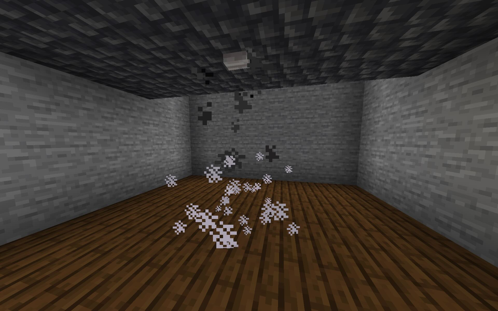

# Fire Sprinkler



**Minecraft 26.x; Fabric and NeoForge.**

This small server-side-only mod turns a button into a working fire sprinkler.
Place a button on the **underside** of a block that is waterlogged (or is a
water source), and any fire that starts in the spray cone beneath it is put out
just like rain — with a hiss and steam — and burning mobs walking through are
extinguished too.

## Installation

This is a **server-side mod** — it goes in the server's `mods/` folder only.
Players connect with a completely unmodified vanilla client.

### Fabric servers

Requires the correct [fabric-api jar](https://modrinth.com/mod/fabric-api) on
the server.

Copy [`firesprinkler-fabric-X.XX.jar`](https://github.com/tomgidden/minecraft-firesprinkler/releases) to the server's `mods/` folder.

### NeoForge servers

Requires [NeoForge](https://neoforged.net/) on the server. No other mods needed.

Copy [`firesprinkler-neoforge-X.XX.jar`](https://github.com/tomgidden/minecraft-firesprinkler/releases) to the server's `mods/` folder.

## Usage

1. Place a block and make it a **water supply**: either waterlog it (e.g. a
   waterlogged slab, stairs, fence, grate, leaves) or put water above it﹡
2. Place a **button on the underside** of that block, so the button hangs from
   the ceiling. (Any button type works.)

That's it. The sprinkler is now armed. It stays invisible and inert until a
fire actually starts (or a burning mob wanders) within its spray cone, at which
point it "rains" on just that spot — putting the fire out with the vanilla
fire-extinguish hiss and a puff of steam.

Because it is *fire-triggered*, an armed sprinkler does *not* hydrate
farmland, drip from leaves, fill cauldrons, or boost fishing the way standing
rain would. It only acts when there is something to put out.

﹡: actually you can put the water above the solid block above *that* instead,
ie. two solid blocks above the button, with water above those.  That way,
client-side water drips can be avoided without resorting to using glass blocks.
So, a tidy solution is a waterlogged grate or leaf block, above two stone blocks,
above a button.

If you don't mind the visual drips, it can just be one stone block between,
or even just a waterlogged grate with a button.  Mangrove roots and copper
grates are good for this because unlike most other waterlogged blocks like
slabs, they'll contain the water without flooding, *and* unlike leaves,
buttons can be placed under them.

### The spray cone

The spray widens as it falls, like a real sprinkler head, then is confined:

| Level below the button | Covered area (centred on the button) |
| ---------------------- | ------------------------------------ |
| Button's own level     | 3×3                                  |
| 1 below                | 5×5                                  |
| 2 below                | 7×7                                  |
| 3 below                | 9×9                                  |
| 4 or more below        | 11×11 (until the depth limit)        |

Water has to be able to reach a spot for it to be sprayed, so a "floor" between
the sprinkler and a fire shelters it. A floor is anything that stops falling
water the way a roof stops rain — full blocks, slabs, stairs, fences, closed
trapdoors. Open trapdoors, string, torches, carpets, flowers, and
water/waterlogged blocks all let the spray through.

The button throws the water outward as it leaves, one block per level, until
the cone reaches its full width; below that the water simply falls. So a solid
block casts a dry shadow straight down, and a hole in a ceiling wets a column
the width of the hole — except where another sprinkler's cone reaches in around
the obstruction. See [`tests/`](tests/) for the geometry checked in-game.

### Configuration

On first launch the mod writes `config/firesprinkler.properties`:

```properties
# Chebyshev radius on the button's own level (0 = just the button cell; 1 = 3x3).
base_radius=1
# Radius the cone widens to before it stops widening (5 = 11x11).
max_radius=5
# Deepest level below the button the spray can reach, in blocks.
max_depth=16
# Probability (0.0-1.0) a sprayed fire is put out per check. 1.0 = instant.
# Set to 0.0 to fall back to vanilla rain's own rate (0.2 + age*0.03 per check).
extinguish_chance=0.8
```

Edit and restart the server to change the cone's size, reach, and speed.

### Extinguish speed

Left to vanilla's rain behaviour, fire is slow to go out: a fire only rolls its
extinguish chance on its own tick (every 30–39 game ticks, ~1.5–2 s), the chance
starts at only 20%, and a fire being rained on never ages so it never climbs.
That averages ~8–9 seconds with a long tail.

A sprinkler is meant to be brisker, so it uses a flat `extinguish_chance` (80% by
default) instead of vanilla's climbing-from-20% rate, and doesn't let a sprayed
fire age. Turn it up to `extinguish_chance=1.0` for a douse on the first check,
or set `extinguish_chance=0.0` to fall back to the exact vanilla rain rate.

Burning **mobs** are not subject to that cadence: entities are checked every tick,
so a mob walking into the spray is doused immediately.

## Single-player

If you drop the mod jar into a singleplayer client's `mods/` folder, it works
in normal singleplayer and via "Open to LAN". If the world is later moved to a
server without the mod, sprinklers simply stop working and buttons behave as
plain vanilla buttons again.

## License and stuff

This mod is covered by the [MIT License](LICENSE.txt).

In short, you may freely use this mod in any modpack, but just don't claim you
made it. No promises, no warranties, so don't blame me if it breaks anything or
disadvantages you in some way, or you believe it did.

[Comments and improvements welcome.](https://github.com/tomgidden/minecraft-firesprinkler)

-- `_gid`


